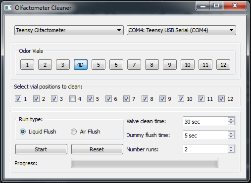

# Olfactometer Cleaning

This is the protocol for cleaning olfactometers using this software and standard lab protocol.

## Solutions
**Solutions are toxic, corrosive, and made with fuming acids and bases. They should be mixed in the fume hood and handled
with care and protective gear. Methanol is toxic and absorbed by bare skin. <u>If you spill on yourself, use the safety
shower and seek medical treatment immediately!</u>**

You will need ~500 ml of solution for each rinse, and ~150 ml of solution to clean fittings.

1. Basic Methanol: 1% ammonium hydroxide (ACS or HPLC grade) in methanol
2. Acidic Methanol: 1% trifluoroacetic acid (ACS or HPLC grade) in methanol
3. Methanol
4. Milli-Q Water (deionized water with low organic content)
5. Acetone

## Equipment
* Normally open end valve w/connectors
* 16 x tubing w/connectors to connect to each vial position (this channels waste from the valve into a waste container)
* 5 x 1L Nalgene glass bottles (Acidic, Basic, Methanol, Water, Acetone)
* Acetone waste container
* Acidic waste container
* Basic waste container

## Hookup
1. Remove all vials and discard contents into appropriate waste container (ie mineral oil waste).
2. Attach tubing to each vial position.
3. Attach normally open End Valve to end of manifold or to 3-way dummy valve depending on model.
4. Connect End Valve to open Dummy Valve electrical connection.

## Software
To use this, run:

    python cleaning.py

from within the olfactometry directory. The gui will guide you through the cleaning process.

## Theory of operation.
1. Apply presurized liquid (5-6 PSIG) through both manifolds simultaneously.
2. Open vial valves and simultaneously close End Valve + dummy.
3. With the end valve closed, cleaning liquid is forced through the vial valves for ~20 sec.
4. Close vial valves and open End Valve + dummy.
5. Allow liquid to flush through the manifold for 5 seconds.
6. Repeat steps 2 - 5 for all valves.
 
