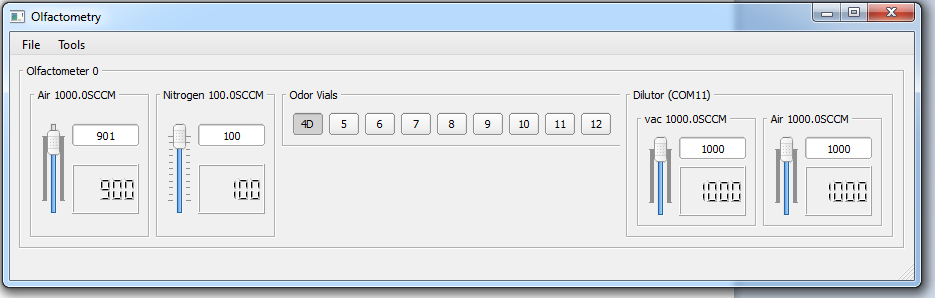

# Olfactometry

An object-oriented PyQt4 based system to control and clean olfactometers in the Rinberg lab.

## Operation and architecture summary
The gui metaphor works fairly consistently with the physical device hierarchy.

Starting an "Olfactometers" class gets things started and acts as a container (list) for all olfactometry devices.
Instantiating an Olfactometers class loads the configuration file and starts configuration of the olfactometers within
that configuration. This class is also the main QT MainWindow that contains the widgets for sub device instances.

Olfactometer and Dilutor instances configure their own QT widgets (ie MFCs and valvegroups). The Olfactometer handles the "protocol"
layer of affecting anything on the olfactometer. It contains the communication layer (ie Serial), and has several public
functions that can be used by external modules to make the olfa do things like open valves or change flow rates.

Finally, there are several MFC classes for different hardware configurations. These configure a gui for the MFC and
provide protocol specific to that device. They have public functions which allow for querying and polling flow rate.
These are currently not intended as stand-alone devices, although this support can be added later. This means that
communication with the MFC relies on public functions from their parent device (ie Olfactometer).

## Architecture graph

Olfactometers = [Olfactometer, Olfactometer, ...]

Olfactometer = [MFCs, Valves, Dilutor]


## JSON configuration file
The configuration of the gui and devices is driven by a new JSON formatted configuration file. Its presence is necessary
for the program to run. Specs are specified in the [config readme](docs/json_specs.md). An example is present in the
project as: [olfa_config.json](olfa_config.json).

The default file location for the config file is C:\\voyeur_rig_config\\olfa_config.json, but this location can be changed
by passing the file location to the instantiating classes.


## Installation and basic use
This program is primarily written in Python. If you are new to Python, I highly recommend installing the great and free
[Anaconda Python Distribution](https://store.continuum.io/cshop/anaconda/). It contains everything you will need here
and more.

Use is straightforward if all dependancies are installed:
* Python 2.7
* PyQt 4.8

Setup is easy using:

    python setup.py install

Once the [JSON configuration file](docs/json_specs.md) is present in the correct directory, the GUI can be run from a python prompt:

```

>>> import olfactometry
>>> config_filename = "C:\\your_config_dir\\your_config_name.json"
>>> olfactometery.main(config_filename)
>>> # if no filename is passed, it will use the default (C:\\voyeur_rig_config\\olfa_config.json)
```



To use the package in a larger program is simple too:
```python
import olfactometry


class MyGui(YourFavoriteQtGuiPackage):  # this works with Enthought's Traits when used in Qt mode.
    def __init__(self, ...):
        self.olfas = olfactometry.Olfactometers(parent=self)  # this will NOT activate the gui.

    def show_olfa_gui(self):
        self.olfas.show()  # just like any QWidget, this will make the olfactometers gui visible.
```

## Use in "Voyeur"
A helpful readme has been made for [implementing this package for use in Voyeur.](docs/voyeur_integration.md)

# Olfactometer cleaning
A cleaning module with gui is included in the olfactometry package. To use it from a python session:

```python

>>> import olfactometry.cleaning
>>> olfactometry.cleaning.main()
```

